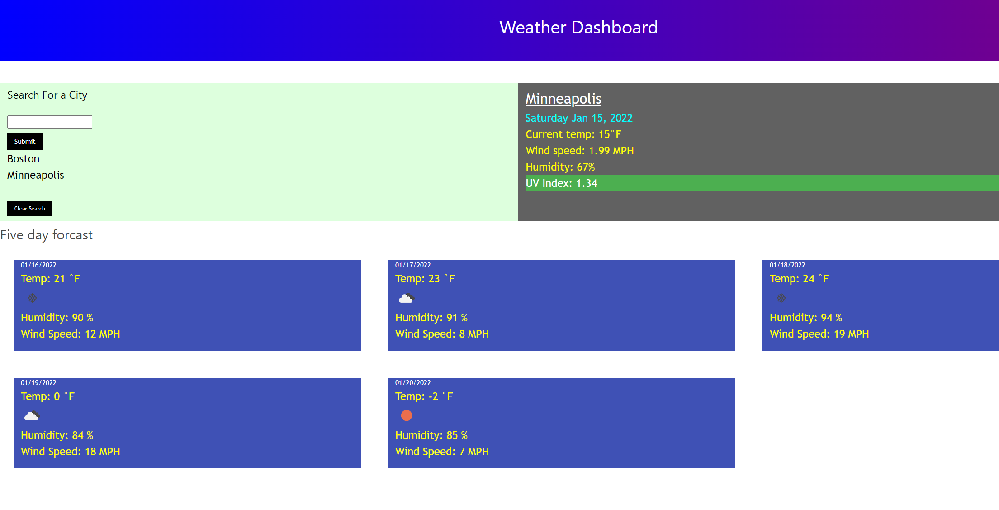
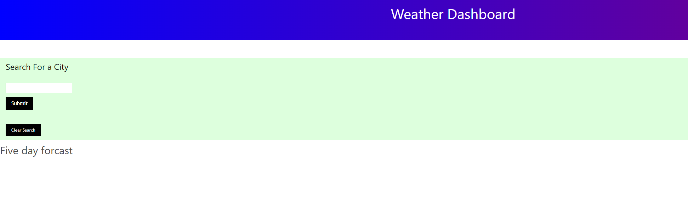

# Weather_Dashboard_APIs-Challenge_MM

## Purpose
A website is challange  for bootcamp so it is an assignment
It is the start of a password generator that I will use to showcase my development skills.

Create a simple calendar application that allows the user to save events for each hour of the day. This app will run in the browser and feature dynamically updated HTML and CSS.

## Built With
* HTML
* CSS
* JavaScript
* Bootstrap
* Moments.js
* JQuery

## Website

xx

## Contribution
Matthew McElwee
1/15/22

### Screenshots of Portfolio
  Image #1

  Image #2
